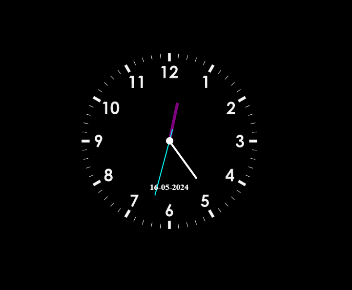
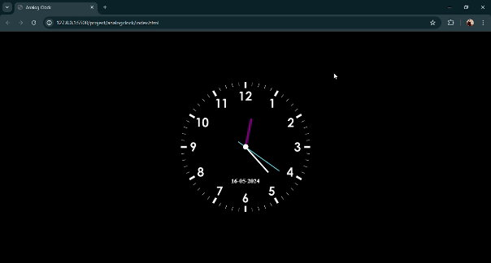

# Analog Clock Project

This project is an implementation of a fully functional analog clock using HTML, CSS, and JavaScript. The clock dynamically updates every second to reflect the current time, displaying hours, minutes, and seconds using rotating hands.

# Features

<ul>
<li>Real-time Updates: The clock updates every second to show the current time accurately.</li>
<li>Pure HTML, CSS, and JavaScript: No external libraries are used, ensuring that the project remains lightweight and easy to understand.</li>
<li>Show the Current Date</li>

# Interface

 <h2>Image</h2>
</img>

 <h2>Video</h2>

# Project Structure

index.html: Contains the HTML structure of the clock. 
styles.css: Contains the CSS styling for the clock, ensuring it looks clean and modern. 
script.js: Contains the JavaScript logic for updating the clock hands in real-time.
HTML Structure 

# How to Use

Clone the repository:  
Copy code 
git clone https://github.com/tapeshchavle/Analog-Clock.git 
Navigate to the project directory: 

# Contributing

If you wish to contribute to this project, please fork the repository and submit a pull request. Contributions are always welcome!

# Contact

you can contact to me tapeshchawle@gmail.com
